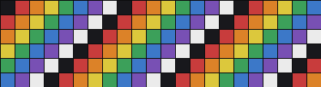

# Price List Plugin

Display a styled price list or menu sign with your own items, prices, and colors, plus automatic page rotation for longer menus.



**→ [Setup Guide](./docs/SETUP.md)**

## Overview

Price List turns your board into a menu or pricing sign for a coffee shop, restaurant, bar, or any small business. Everything on the sign comes from the plugin settings — no external data source: you enter item names and prices, pick a currency symbol, choose a line style (dot leaders, right-aligned, or compact), and optionally add a title and per-item color tiles. When you have more items than fit on one page, the sign automatically rotates through pages on a timer you control.

## Template Variables

### Current Page Lines

The easiest way to use the plugin: put `line_1` through `line_6` on a page and you get the fully formatted, auto-rotating sign.

| Variable | Description | Example |
|----------|-------------|---------|
| `{{price_list.line_1}}` | Line 1 of the current page (rotates automatically) | `{65} DAILY BREW {65}` |
| `{{price_list.line_2}}` | Line 2 of the current page | `LATTE...........$4.50` |
| `{{price_list.line_3}}` | Line 3 of the current page | `CAPPUCCINO......$4.25` |
| `{{price_list.line_4}}` | Line 4 of the current page | `DRIP COFFEE.....$3.00` |
| `{{price_list.line_5}}` | Line 5 of the current page | `COLD BREW.......$4.75` |
| `{{price_list.line_6}}` | Line 6 of the current page | `MATCHA..........$5.50` |

### Sign Info

| Variable | Description | Example |
|----------|-------------|---------|
| `{{price_list.title}}` | The configured sign title | `DAILY BREW` |
| `{{price_list.page_number}}` | Page currently showing (1-based) | `1` |
| `{{price_list.page_count}}` | Total number of pages | `2` |
| `{{price_list.page_label}}` | `PAGE X/Y` (empty when there is only one page) | `PAGE 1/2` |
| `{{price_list.item_count}}` | Total number of configured items | `8` |

### All Items

Every configured item is also exposed as an indexed array for fully custom layouts:

| Variable | Description | Example |
|----------|-------------|---------|
| `{{price_list.items.0.name}}` | Item name | `LATTE` |
| `{{price_list.items.0.price}}` | Raw price text | `4.50` |
| `{{price_list.items.0.price_display}}` | Price with currency symbol | `$4.50` |
| `{{price_list.items.0.formatted}}` | Full 22-tile formatted line | `LATTE............$4.50` |
| `{{price_list.items.0.color_tile}}` | The item's color tile marker (empty if none) | `{66}` |

## Example Templates

The drop-in rotating sign:

```jinja
{{price_list.line_1}}
{{price_list.line_2}}
{{price_list.line_3}}
{{price_list.line_4}}
{{price_list.line_5}}
{{price_list.line_6}}
```

A brewery tap list is just different config — items like `Hazy IPA / 7.00 / yellow` with the title `TAPROOM DRAFTS` render as:

```
  🟧 TAPROOM DRAFTS 🟧
🟨 HAZY IPA.......$7.00
WEST COAST IPA...$6.50
🟥 AMBER ALE......$6.00
PILSNER..........$5.50
STOUT NITRO......$7.50
```

A custom layout mixing specific items with other plugins:

```jinja
{center}{65} HAPPY HOUR {65}
{{price_list.items.0.formatted}}
{{price_list.items.1.formatted}}
{{price_list.items.2.formatted}}

{center}{{date_time.time}}
```

## Configuration

| Setting | Type | Required | Default | Description |
|---------|------|----------|---------|-------------|
| `enabled` | boolean | No | false | Enable/disable the plugin |
| `title` | string | No | (blank) | Optional heading shown at the top of every page |
| `title_color` | string | No | none | Colored tile on each side of the title (`red`, `orange`, `yellow`, `green`, `blue`, `violet`, `white`) |
| `items` | array | **Yes** | — | The products to show: each has a `name`, a `price`, and an optional `color` bullet |
| `currency_symbol` | string | No | `$` | Added to every price (e.g. `$`, `USD`, `KR`); blank for none |
| `currency_position` | string | No | before | `before` → `$4.50`, `after` → `4.50 KR` |
| `price_style` | string | No | dots | `dots` → `LATTE....$4.50`, `spaces` → right-aligned, `compact` → `LATTE $4.50` |
| `items_per_page` | integer | No | 5 | Maximum items shown at once (1–6; a title takes one line) |
| `rotation_seconds` | integer | No | 30 | How long each page shows before rotating (10–3600) |

## Features

- Fully config-driven — no API keys, accounts, or network access needed
- Three price line styles: dot leaders, right-aligned, and compact
- Optional sign title with color accent tiles
- Per-item color bullets for highlighting specials or categories
- Currency symbol before or after the price, or none at all
- Automatic page rotation when the menu is longer than one screen
- Board-safe validation with clear error messages for unsupported characters

## Author

FiestaBoard Team
